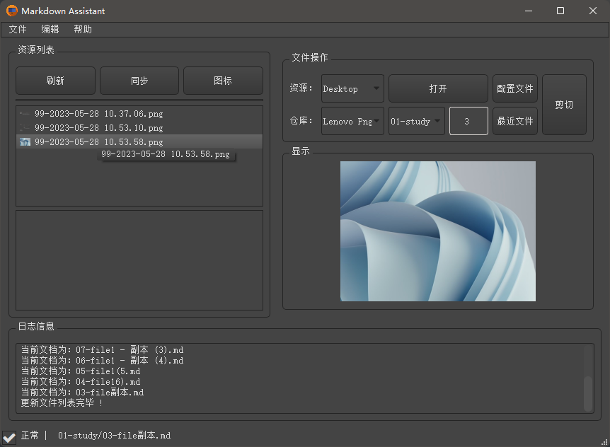
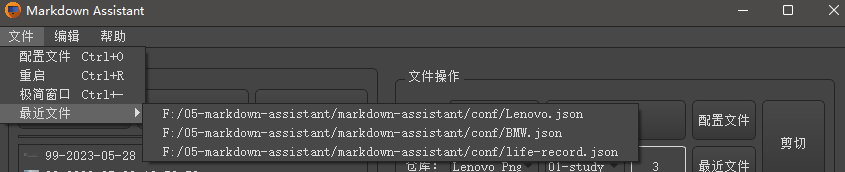
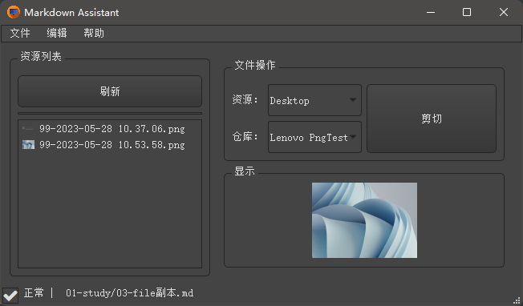
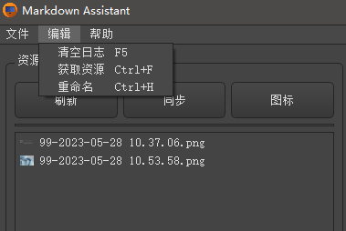
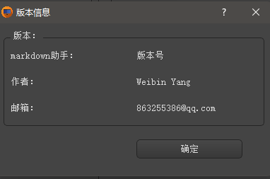
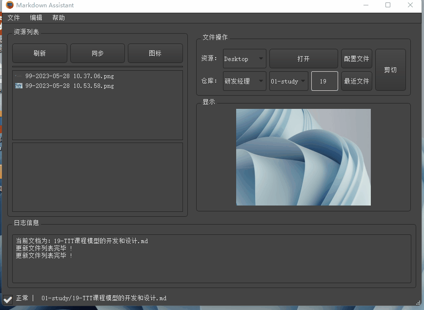
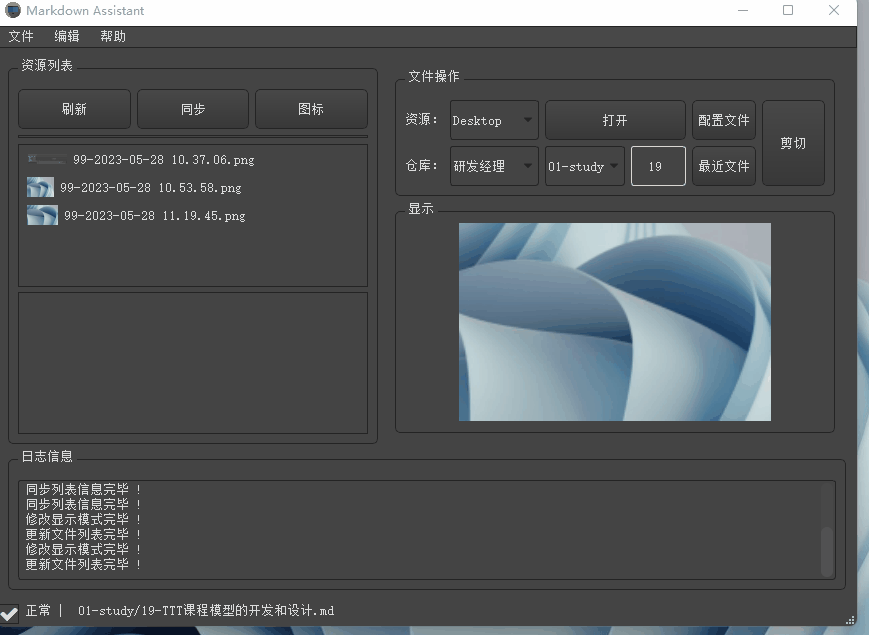
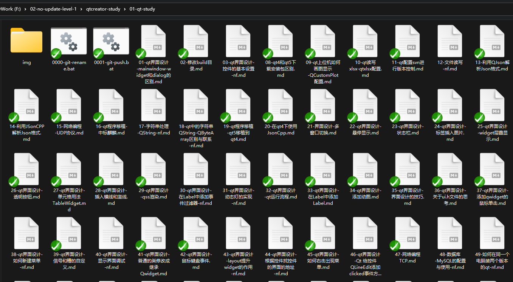

# [Markdown助手](./)   [img](./img)  

## 1 简介 

Markdown助手的主要是用于Markdown文件编写过程中，资源的管理以及文件的批量修改，可以帮助Markdown的编辑人员，更加专注于文件的编写，提高文档的编辑效率。如果图片加载不下来，可以移步[CSDN博客介绍](https://blog.csdn.net/tangsenghandan/article/details/130914281?csdn_share_tail=%7B%22type%22%3A%22blog%22%2C%22rType%22%3A%22article%22%2C%22rId%22%3A%22130914281%22%2C%22source%22%3A%22tangsenghandan%22%7D)。

## 2 功能介绍  

### 2.1 操作界面  



主界面中的包含：菜单栏、资源列表、文件操作和日志信息这四大部分。下面针对四部分进行演示。

### 2.2 菜单栏   

#### 2.2.1 文件  



- 配置文件：可以对用户的配置文件进行修改，包括：软件配置文件`*.ini` 和用户配置文件`*.json`        
- 重启：重新启动软件，刷新资源列表   
- 极简窗口：可以将软件界面缩小，仅仅展示添加的资源和当前文件信息  



- 最近文件：显示当前用户的配置文件列表    

#### 2.2.2 编辑 



- 清空日志：将日志信息情况   
- 获取资源：通过Markdown代码自动索引相应的资源  
- 重命名：将文件名字修改完成，并将当前仓库中的文件索引位置进行修改   

#### 2.2.3 帮助  



目前只是显示版本信息，如果有其他问题，可以邮件联系作者本人。欢迎进行技术交流。

### 2.3 资源列表   



- 刷新：刷新资源列表。上面的列表是需要添加到Markdown中的资源列表，下面的列表是不放到Markdown中的资源。      
- 同步：单击资源，可以选中，上面的列表和下面的列表如果有选中的会互换位置     
- 图标：列表中的资源可以显示list方式，也可以使用大图标模式    
- 双击资源名：可以将资源调整到另一个列表中  
- 上面的list是真正要添加到Markdown中的资源  

### 2.4 文件操作   



- 资源：资源的目录，一般是截图的图片或者视频等资源  
- 仓库：当前编辑文档库所在的仓库 ，仓库后面是当前仓库的子目录列表：01-study  等   
- 打开：打开当前的文件  
- 最近文件：最近修改的文件  
- 后面的数字19：代表当前文件的编号  
> #### ***注意：***   
>
> 仓库中的Markdown文件需要用01-名字，进行编号，这样既方便进行编号管理，有方便文档的管理。例如：
>
>  

- 剪切：将资源文件剪切到当前文档所在的img目录下，会自动筛查文件编号，添加新的文件  
- 剪切后可以在将Markdown的代码放到剪切板中  ： 
```markdown
<center>    
   
</center>   
```

### 2.5 显示与日志  

- 显示：是当前资源的缩略图，目前支持图片和视频的预览   
- 日志：当面操作的记录   

## 3 配置文件  

配置文件对应的目录是 [conf](conf) 。这部分功能后期可以通过可视化界面的方式方便用户进行自主的更新和配置，目前先通过配置文件进行修改相关内容。配置文件包含两部分：ini文件和json文件。对于文件的详细说明可以参考文档： [CONFIG.md](CONFIG.md) 。 

## 4 开发计划 

计划开发一套完善的Markdown助手软件，需要迭代的功能进行了整理，如果有哪些功能见开发文档：[CHANGED-LOG.md](CHANGED-LOG.md)   

## 5 关于作者  

该软件的开发人员是本人一人完成，由于平时工作忙碌，还有其他有待开发的其他功能，而且对于功能的测试还不完善，欢迎感兴趣的coder可以加入进来。也可以通过邮件的方式进行技术交流：863255386@qq.com。  
